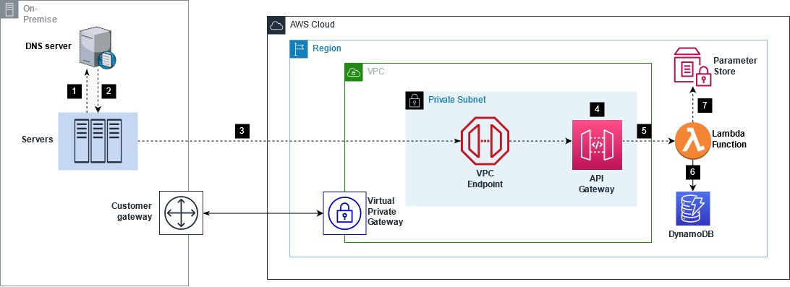
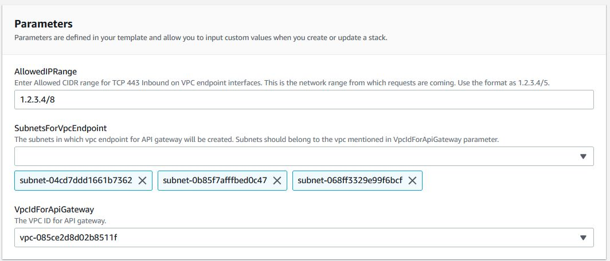
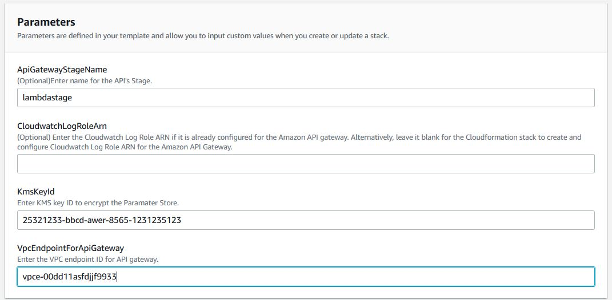
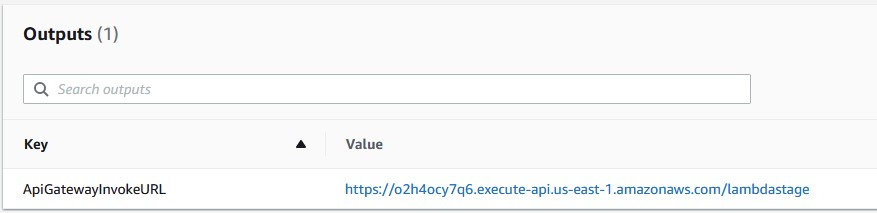

# Automate AWS Systems Manager activation for hybrid managed node registration

AWS Systems Manager (formerly known as [SSM](https://docs.aws.amazon.com/systems-manager/latest/userguide/what-is-systems-manager.html#service-naming-history "https://docs.aws.amazon.com/systems-manager/latest/userguide/what-is-systems-manager.html#service-naming-history")) is an AWS service that you can use to view and control your servers on AWS cloud and and on-premise infrastructure. Therefore, AWS Systems Manager makes it is easy to manage a _hybrid environment_ which consists of Amazon Elastic Compute Cloud (Amazon EC2) instances, edge devices, and on-premises servers and virtual machines (VMs), including VMs in other cloud environments.

To set up servers and virtual machines (VMs) in your hybrid environment as managed instances, you create a managed-instance activation. After you successfully complete the activation, you _immediately_ receive an Activation Code and Activation ID. You specify this Code/ID combination when you install AWS Systems Manager SSM Agent on servers and VMs in your hybrid environment. The Code/ID provides secure access to the Systems Manager service from your managed instances.

Every Activation you create has an _activation expiration_ and _registration limit value._ An _activation expiration_ is a window of time when you can register on-premises machines with Systems Manager. The Max value you can specify for this parameter is 30 days. A _registration limit_ specifies the  the maximum number of managed nodes you can register. When either of the value is reached, you can no longer use the same managed-instance activation and would need that you manually create a new managed-instance activation in order to continue registering new servers in your hybrid environment.

In this blog post, I will walkthrough the solution on automating the System Manager Hybrid Activations creation. This removes the manual intervention of managing these credentials which includes recreating the credentials when registration count is over or the Expiration date has passed.


# Solution Overview
The solution is enabled using AWS CloudFormation stack. The Cloudformation stack creates AWS resources on your account needed for the solution. Following are these resources :

-  **Amazon API gateway**: REST API of Private Type, Integrated with AWS Lambda function. When the web client from the on-premise server performs a GET request to the API gateway, it returns the Hybrid Actions Code/ID combination.

-  **AWS Lambda**: The Lambda function provides the Hybrid Activations Code/ID combination to the on-premise server via the API gateway. It will create a new activation code if it finds the existing Activation code is expired or reached registration limit.

-  **Amazon DynamoDB**: To store the state. The Lambda updates the table to ‘Locked’ state, if it is serving a request from a client. It updates the table to ‘Unlocked’ after completing serving the request.

-  **Amazon VPC Endpoint**: VPC Endpoint for API gateway for privately access the API gateway URL from the on-premise network.

-  **AWS Systems Manager Parameter Store**: To store the Hybrid Activations ID/Code.



**Following is a brief flow of the executions:**

1)  The web client calls the private API Gateway endpoint (for example, GET [https://abc123xyz0.execute-api.eu-west-1.amazonaws.com/demostage](https://abc123xyz0.execute-api.eu-west-1.amazonaws.com/demostage "https://abc123xyz0.execute-api.eu-west-1.amazonaws.com/demostage")).

2)  When connecting from on-premise servers, the on-premise DNS server should be configured to forward request to VPC DNS to get the private IP address of the VPC Endpoint. The DNS server resolves and sends back the IP address to the web client.

3)  The request is sent to private IP address of the VPC Endpoint of the API Gateway.

4)  The resource Policy of the API gateway is checked to see if the request is coming from the VPC endpoint of the API gateway. If not, it is forbidden.

5)  API Gateway passes the request to Lambda through an integration request.

6)  Lambda updates the state key in DynamoDB to 'Locked' indicating it is serving the request.

7)  Lambda retrieves the credentials from Parameter Store and sent it back to the client.

# Walkthrough

**Prerequisites:**

For this walkthrough, you should have the following:

-   An [AWS account](https://signin.aws.amazon.com/signin?redirect_uri=https%3A%2F%2Fportal.aws.amazon.com%2Fbilling%2Fsignup%2Fresume&client_id=signup)
-   An IAM user/role who can:

	-   Create a private API, create a method, and deploy it in API Gateway
	-   Create Lambda function, DynamoDB, Parameter Store Parameter and Cloudwatch Log Group.
	-   Create a new IAM role with a trust policy. Read more on [Granting least privilege](https://docs.aws.amazon.com/IAM/latest/UserGuide/best-practices.html#grant-least-privilege) when creating IAM policies.

-   The VPC you are deploying to must have both [enableDnsSupport and enableDnsHostnames VPC](https://docs.aws.amazon.com/vpc/latest/userguide/vpc-dns.html#vpc-dns-updating) attributes set to **true**.
-   Basic familiarity with AWS CloudFormation, AWS Systems Manager, and Amazon API Gateway.

## Step 1: Create VPC endpoint for API Gateway

In the first step, you create VPC endpoints for the API Gateway in your VPC. You also create a security group attached to the endpoint to allow a TCP port 443. Use the below steps to automate this using Cloudformation.

**Note: If a VPC endpoint for API gateway already exists for the VPC, skip this step and take note of the existing vpc endpoint id.**

1. Download the _createVpcEndpoint.yml_ template file found under Cloudformation Templates folder.

2. Visit the [AWS CloudFormation console](https://console.aws.amazon.com/cloudformation/home) in your preferred region.

3.  Choose **Create stack**, and then choose **With new resources (standard)**.
4.  On the **Create stack** page, select **Upload a template**. Choose the template you downloaded in preceding step. Select Next.
5.  Provide a **Stack name**. For example, _vpcendpoint-setup_.
6. The CloudFormation stack requires a few parameters, as shown in the following screenshot.



7. Choose **Next** on the **Configure stack options** page.
8. Review the configuration options and choose Create stack.
9.  Verify that the stack has a status of **CREATE_COMPLETE**.
10.  Once the stack has been created, refer the Outputs section of your stack and copy the VPC endpoint ID.


## Step 2: Create a KMS Key.

In this step, you will create a KMS key to encrypt Parameter Store. Here, Parameter store is used to store the Activation Code and Activation ID. To create a KMS key,

1. Open the AWS Key Management Service (AWS KMS) console at [https://console.aws.amazon.com/kms](https://console.aws.amazon.com/kms)

2. In the navigation pane, choose **Customer managed keys** and click on Create Key.

3. Choose symmetric KMS key and click on Next

4. Review the other configuration options and create the Key.

5. Once created, take note of the key ID.

## Step 3: Create API Gateway and Lambda.

In the final step, you will create and deploy a Private API & Lambda function. Use the below steps to automate this using Cloudformation.

1.  Download the _createApiGatewayLambda.yml_ template file found under Cloudformation Templates folder.
2.  Visit the [AWS CloudFormation console](https://console.aws.amazon.com/cloudformation/home) in your preferred region.
3.  Choose **Create stack**, and then choose **With new resources (standard)**.
4.  On the **Create stack** page, select **Upload a template**. Choose the template you downloaded in preceding step. Select Next.
5. Provide a **Stack name**. For example, _apigateway-lambda-setup_.
6.  The CloudFormation stack requires a few parameters, as shown in the following screenshot.




7. Review the details of your parameters and check the box I acknowledge that AWS CloudFormation might create IAM resources. Then select Create stack to start building the resources.
8. Once the stack has been created, refer the Outputs section of your stack and copy the API Gateway Invoke URL.



9. From the on-premise server which needs to be registered, access the copied URL using curl/wget or any other web client. The Activation ID/Code combination is returned in the JSON format. In the below example, on my Linux terminal, I am using curl and an optional jq package command to give a structured & formatted view of the output.

```
[root@ec2amaz-r1rvyg ~]# curl -s https://o2h4ocy7q6.execute-api.us-east-1.amazonaws.com/lambdastage | jq '.'
{
 "ActivationId": "e50a8437-23dd-4326-9e79-5e3b7573493e",
 "ActivationCode": "vVcH9zJX4ROy2XTsh5cb"
 }
``` 
**Note:** You can improve the security of the above created [private API](https://docs.aws.amazon.com/apigateway/latest/developerguide/apigateway-private-apis.html) by configuring the VPC endpoint to use _VPC endpoint policy._ A _VPC endpoint policy_ is an IAM resource policy that you can attach to an interface VPC endpoint to control access to the endpoint. VPC endpoint policies can be used together with API Gateway resource policies. The resource policy is used to specify which principals can access the API. The endpoint policy specifies which private APIs can be called via the VPC endpoint.

Follow the documentation reference to [Create VPC endpoint policies for private APIs in API Gateway](https://docs.aws.amazon.com/apigateway/latest/developerguide/apigateway-vpc-endpoint-policies.html)


# Example scripts for automatic activation
You can use the API Gateway Invoke URL,which you copied from the output section of the Cloudformation stack, in your Shell/Powershell script when installing SSM Agent. For testing and validation, you can save and run the following example scripts on a Redhat Based server or a Windows Server. For deployment at scale, have the script run on your server launch.


**Linux:**

-  A Shell script to retrieve Hybrid Activation credentials and install SSM Agent with the obtained credentials and register to the us-east-1 region:
```
#!/bin/bash
sudo yum erase amazon-ssm-agent --assumeyes

credentials=$(curl -s https://cla9phiczg.execute-api.us-east-1.amazonaws.com/lambdastage)
activationcode=$(echo $credentials | jq -r '.ActivationCode')
activationid=$(echo $credentials| jq -r '.ActivationId') 

mkdir /tmp/ssm
curl https://s3.amazonaws.com/ec2-downloads-windows/SSMAgent/latest/linux_amd64/amazon-ssm-agent.rpm -o /tmp/ssm/amazon-ssm-agent.rpm
sudo dnf install -y /tmp/ssm/amazon-ssm-agent.rpm
sudo systemctl stop amazon-ssm-agent
sudo -E amazon-ssm-agent -register -code $activationcode -id $activationid -region us-east-1
sudo systemctl start amazon-ssm-agent
```
**Note**: Replace the URL in the example with the URL from your Cloudformation Stack Output.

**Windows:**

-  A Power Shell script to retrieve Hybrid Activation credentials and install SSM Agent with the obtained credentials and register to the us-east-1 region:
```
$credential = Invoke-WebRequest -URI https://cla9phiczg.execute-api.us-east-1.amazonaws.com/lambdastage | Select-Object -ExpandProperty Content
$credentialPSObject = $credential | ConvertFrom-Json
 
$code = $credentialPSObject.ActivationCode
$id = $credentialPSObject.ActivationId
$region = "us-east-1"
$dir = $env:TEMP + "\ssm"
 
New-Item -ItemType directory -Path $dir -Force
cd $dir
(New-Object System.Net.WebClient).DownloadFile("https://amazon-ssm-$region.s3.$region.amazonaws.com/latest/windows_amd64/AmazonSSMAgentSetup.exe", $dir + "\AmazonSSMAgentSetup.exe")
Start-Process .\AmazonSSMAgentSetup.exe -ArgumentList @("/q", "/log", "install.log", "CODE=$code", "ID=$id", "REGION=$region") -Wait
Get-Content ($env:ProgramData + "\Amazon\SSM\InstanceData\registration")
Get-Service -Name "AmazonSSMAgent"
```
**Note**: Replace the URL in the example with the URL from your Cloudformation Stack Output.

# Cleaning up

To clean up the environment, [deregister](https://docs.aws.amazon.com/systems-manager/latest/userguide/systems-manager-managed-instances-advanced-deregister.html "https://docs.aws.amazon.com/systems-manager/latest/userguide/systems-manager-managed-instances-advanced-deregister.html") the servers from Systems Manager. Then [delete the AWS CloudFormation stack](https://docs.aws.amazon.com/AWSCloudFormation/latest/UserGuide/cfn-console-delete-stack.html "https://docs.aws.amazon.com/AWSCloudFormation/latest/UserGuide/cfn-console-delete-stack.html") you created in the walkthrough by deleting **Create API Gateway and Lambda** CloudFormation Stack first followed by **Create VPC endpoint for API Gateway** CloudFormation Stack. At last, [delete the KMS key](https://docs.aws.amazon.com/kms/latest/developerguide/deleting-keys.html) created in the walkthrough.


## Security

See [CONTRIBUTING](CONTRIBUTING.md#security-issue-notifications) for more information.

## License

This library is licensed under the MIT-0 License. See the LICENSE file.

